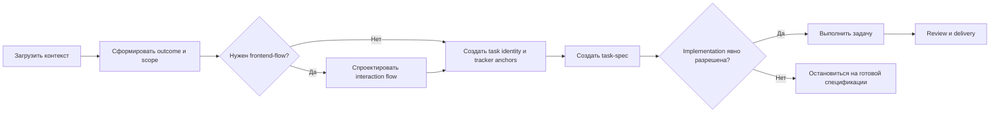

# Marshall AI Agent Skills

Личная библиотека reusable skills для Codex. Набор описывает не продуктовую логику конкретного проекта, а переносимые рабочие процессы: от загрузки контекста и формирования задачи до реализации, review, delivery и обслуживания проектной документации.

Сейчас в репозитории находятся 12 reusable skills, включая интерактивный `configure-project-workflow` для безопасной первоначальной настройки и последующей проверки проекта. Набор версионируется и выпускается как единый совместимый workflow kit.

## Основная идея

Рабочий процесс разделён на три слоя:

1. **Reusable skill** определяет универсальную процедуру, границы полномочий и точки передачи работы.
2. **Project configuration** хранит названия репозиториев, пути, статусы, Task ID, GitHub Project, локали, quality gates и другие значения конкретного проекта.
3. **Project instructions и docs** содержат постоянно активные правила, архитектуру, продуктовый контекст и локальные runbooks.

Skills не должны содержать жёсткую привязку к одному проекту. Полный workflow предполагает, что подключающий проект создаст собственные `AGENTS.md` и `.codex/project-workflow.yaml`.

## Первая настройка проекта

Для стабильной установки используйте exact release tag. Текущий опубликованный
релиз — [`v0.1.0`](https://github.com/rubyhat/marshall-ai-agent/releases/tag/v0.1.0):

```bash
git clone --branch v0.1.0 --depth 1 git@github.com:rubyhat/marshall-ai-agent.git
cd marshall-ai-agent
```

Ветка `main` может содержать ещё не выпущенные изменения и считается
development source, а не стабильной revision.

Затем установите bootstrap skill:

```bash
mkdir -p ~/.codex/skills
cp -R skills/configure-project-workflow ~/.codex/skills/
```

Затем откройте Codex в корне настраиваемого проекта и запустите:

```text
$configure-project-workflow
```

После появления project routing повторную настройку можно вызывать командой:

```text
--workflow-setup
```

Первоначальная настройка проходит поэтапно:

1. Агент объявляет обязательную safety boundary и спрашивает, нужны ли дополнительные пользовательские ограничения.
2. Проводит bounded read-only inspection папок, инструкций, безопасных manifests, repository metadata и существующей документации.
3. Создаёт только временный tracker `.codex/project-workflow.setup.json`.
4. Рекомендует workflow profile и применимые skills.
5. Проводит staged interview: по 7–10 вопросов на активный этап, сохраняя ответы и возвращаясь к незавершённым вопросам после любых detours.
6. Показывает точный mutation manifest: устанавливаемые skills, создаваемые и изменяемые файлы, aliases, templates и validation plan.
7. Только после подтверждения manifest устанавливает skills и создаёт project-specific configuration, instructions и docs.
8. Проверяет module dependencies, paths, aliases, managed instructions, active copies и representative dry-run routes.
9. При успешной настройке удаляет временный tracker и останавливается, не начиная обычную project task.

До подтверждения manifest skill не запускает project code, tests, builds, migrations, services или containers; не читает secrets и `.env`; не обращается к GitHub, production или другим внешним сервисам; не создаёт полную структуру `docs_ai` или `local_memory_ai`.

Если настройка была прервана, повторный `$configure-project-workflow` или `--workflow-setup` продолжает её с первой незавершённой стадии. Read-only проверка уже настроенного проекта запускается через:

```text
--workflow-check
```

## Рекомендуемый основной flow



Соответствующие skills:

1. `load-project-context` — загрузить минимально достаточный контекст.
2. `shape-project-work` — согласовать outcome, scope, решения, риски и декомпозицию.
3. `design-frontend-flow` — при необходимости определить frontend interaction contract.
4. `manage-project-work` — создать или сверить Task ID, Issue, hierarchy и Project state.
5. `write-task-spec` — создать implementation-ready спецификацию.
6. `execute-project-task` — выполнить одну явно разрешённую задачу и подготовить незакоммиченные изменения к local review.
7. `deliver-reviewed-change` — провести independent review, PR, bounded review cycle, merge и cleanup в пределах разрешённого endpoint.

`record-project-context` применяется в durable checkpoints по всему flow, а не только в конце. Готовая спецификация сама по себе не разрешает implementation, а выполненная implementation-задача сама по себе не разрешает commit, push или merge.

## Дополнительные flows

### Frontend QA

```text
triage-frontend-qa
  → confirmed actionable defect
  → manage-project-work
  → write-task-spec
  → execute-project-task только при явном fix/implement request
  → deliver-reviewed-change
```

No-repro, expected behavior и unresolved ownership не должны автоматически создавать confirmed bug task или запускать реализацию.

### Анализ внешнего продукта

```text
analyze-product-reference
  → evidence и target implications
  → shape-project-work и/или design-frontend-flow
  → обычный task workflow только после отдельного решения
```

Внешний reference не является source of truth и не передаётся напрямую в implementation.

### Project context

- `load-project-context` — частая read-only ориентация перед новой или возобновлённой задачей.
- `record-project-context` — точечная запись durable или active knowledge через `skip → link → update → create`.
- `maintain-project-context` — редкий ручной аудит и отдельно подтверждённая cleanup-фаза по точному manifest.

Обычное завершение задачи не запускает broad context cleanup.

## Каталог skills

| Skill | Назначение |
| --- | --- |
| `configure-project-workflow` | Безопасно исследует проект, проводит resumable interview, устанавливает выбранные modules и создаёт project workflow. |
| `load-project-context` | Загружает только контекст, необходимый для текущей содержательной задачи. |
| `record-project-context` | Сохраняет durable project knowledge без дублирования источников истины. |
| `maintain-project-context` | Аудирует, консолидирует и безопасно очищает project memory/documentation через двухфазный процесс. |
| `manage-project-work` | Управляет Task ID, hierarchy, GitHub Issues/Projects, статусами и связями task/spec/PR. |
| `shape-project-work` | Превращает идею или проблему в согласованный outcome, scope и conceptual work breakdown. |
| `write-task-spec` | Создаёт, обновляет и проверяет full или lightweight task specifications. |
| `execute-project-task` | Выполняет одну implementation-ready задачу в изолированном workspace до local-review handoff. |
| `deliver-reviewed-change` | Проводит точную задачу через independent review, PR, review feedback, merge и cleanup. |
| `design-frontend-flow` | Проектирует frontend surfaces, states, actions, recovery, responsive behavior и contract needs. |
| `triage-frontend-qa` | Воспроизводит и классифицирует один конкретный frontend-дефект. |
| `analyze-product-reference` | Исследует внешний продукт как bounded evidence и адаптирует findings к целевому проекту. |

Каждая папка skill содержит обязательный `SKILL.md`, UI metadata в `agents/openai.yaml` и только необходимые `references`, `scripts` или `assets`.

## Быстрые команды

Поддерживаемые workflow предусматривают следующие project aliases:

| Команда | Действие |
| --- | --- |
| `--workflow-setup` | Начать, продолжить или изменить guided project setup. |
| `--workflow-check` | Провести read-only audit текущей project workflow configuration. |
| `--context-audit [scope]` | Запустить только read-only аудит project context. |
| `--task-check <Task ID или Issue URL>` | Проверить согласованность одной задачи. |
| `--task-status <Task ID или Issue URL> <status>` | Изменить только статус одной точной задачи. |
| `--planning-session [scope]` | Зафиксировать discussion/shaping профиль текущей сессии. |
| `--shape-work <идея или task anchor>` | Запустить guided shaping без автоматических mutations. |
| `--shape-roadmap <идея или task anchor>` | Подготовить roadmap decomposition и mutation preview без full specs. |
| `--prepare-spec <Task ID или task anchor>` | Обсудить точную задачу и после ответов создать task-spec. |
| `--accept-recommended` | Принять рекомендации только в текущем наборе вопросов. |
| `--design-flow <идея или task anchor>` | Обсудить frontend-flow без создания кода или артефакта. |
| `--qa-triage <report, URL или task anchor>` | Провести bounded triage конкретного frontend-дефекта. |
| `--reference-analysis <product, URL, artifact или вопрос>` | Выполнить chat-first анализ внешнего reference. |
| `--spec-check <Task ID или spec path>` | Провести read-only audit task-spec. |
| `--execute-task <Task ID, Issue URL или spec path>` | Выполнить локальную implementation одной ready-задачи. |
| `--deliver-task <Task ID, PR URL, spec path или current task>` | Запустить разрешённый delivery-flow одной точной задачи. |

Это plain-text соглашения проекта, а не встроенные пользовательские slash-команды Codex. Они начинают работать только после маршрутизации в project instructions и configuration. Alias не расширяет полномочия за пределы, явно описанные соответствующим skill и проектной политикой.

Подробные contracts, защита от ошибочного порядка и рекомендуемые
последовательности собраны в
[`docs/workflow-aliases.md`](docs/workflow-aliases.md).

## Установка

Для первой настройки достаточно вручную установить `configure-project-workflow`; после manifest approval он поможет установить выбранные modules. При необходимости skills можно установить вручную.

Стабильная project configuration должна сохранять exact release tag в
`workflow_kit.revision`. Для проверки ещё не выпущенного изменения допустим
полный commit SHA. Floating branch вроде `main` не считается воспроизводимой
revision.

Установка одного skill:

```bash
mkdir -p ~/.codex/skills
cp -R skills/load-project-context ~/.codex/skills/
```

Установка всего набора:

```bash
mkdir -p ~/.codex/skills
for skill in skills/*; do
  cp -R "$skill" ~/.codex/skills/
done
```

Перед обновлением уже установленной копии нужно проверить локальные изменения. Простое копирование не создаёт project configuration, `AGENTS.md`, Task ID policy, templates или GitHub integration.

## Версионирование и релизы

Весь repository имеет одну SemVer-версию. Один tag представляет совместимый
снимок всех skills, references, scripts и assets; отдельные skills не получают
независимые release versions.

Release Please поддерживает один Release PR:

1. обычные изменения попадают в `main` через Conventional Commit squash;
2. Release Please обновляет версию и `CHANGELOG.md`;
3. `Validate / Skills` проверяет Release PR;
4. ручной merge Release PR создаёт tag `vX.Y.Z` и опубликованный GitHub Release.

`schema_version` внутри configuration и bundled artifacts остаётся отдельной
версией формата и не заменяет SemVer workflow kit.

Подробности:

- [правила участия](CONTRIBUTING.md);
- [release runbook](docs/releasing.md);
- [текущий опубликованный релиз `v0.1.0`](https://github.com/rubyhat/marshall-ai-agent/releases/tag/v0.1.0);
- текущая development version — [version.txt](version.txt);
- история изменений — [CHANGELOG.md](CHANGELOG.md).

## Что должен определить подключающий проект

Как минимум:

- тип и назначение проекта;
- один или несколько repositories и их ownership;
- project instructions и critical safety invariants;
- расположение memory, docs, task specs и templates;
- Task ID, hierarchy, Issue и Project policy;
- lifecycle statuses и разрешённые transitions;
- worktree, branch, review, merge и cleanup policy;
- localization, migration, security, privacy и production gates;
- включённые workflow modules и aliases;
- правила уточняющих вопросов и conflict/risk gate.

Эти значения не следует копировать из другого проекта без проверки.

## Границы безопасности

- Каждый skill работает только в своём scope и передаёт следующую фазу owning workflow.
- Read-only alias не разрешает исправления или внешние mutations.
- Task/spec readiness не означает разрешение на implementation.
- Implementation не означает разрешение на publication или merge.
- Cleanup, destructive actions, production mutations и broad synchronization требуют отдельной применимой authority.
- Project-specific safety, privacy, tenant, billing, legal и deployment rules имеют приоритет над общим reusable flow.

## Структура репозитория

```text
marshall-ai-agent/
├── .github/workflows/
│   ├── release-please.yml
│   └── validate.yml
├── docs/
│   └── releasing.md
├── scripts/
│   └── validate_repository.py
├── skills/
│   ├── analyze-product-reference/
│   ├── configure-project-workflow/
│   ├── deliver-reviewed-change/
│   ├── design-frontend-flow/
│   ├── execute-project-task/
│   ├── load-project-context/
│   ├── maintain-project-context/
│   ├── manage-project-work/
│   ├── record-project-context/
│   ├── shape-project-work/
│   ├── triage-frontend-qa/
│   └── write-task-spec/
├── AGENTS.md
├── CHANGELOG.md
├── CONTRIBUTING.md
├── README.md
├── release-please-config.json
├── version.txt
├── .gitignore
└── .release-please-manifest.json
```

## Развитие и проверка

Для создания и обновления skills используется системный `skill-creator`.

Минимальный цикл изменения:

1. Проверить trigger, exclusions и ownership boundaries.
2. Обновить `SKILL.md` и только необходимые bundled resources.
3. Убедиться, что `agents/openai.yaml` соответствует текущему skill.
4. Запустить `python3 scripts/validate_repository.py`.
5. Для изменённого skill запустить системный `quick_validate.py`.
6. Синхронизировать устанавливаемую копию только после успешной проверки.

Repository validator проверяет каталог skills, frontmatter, UI metadata,
относительные ссылки, JSON, Python syntax, portability и bundled script tests.

## Roadmap

- forward-test `configure-project-workflow` на новых single-repo и multi-repo проектах;
- стабилизировать sync/publishing policy между библиотекой и установленными copies;
- расширять schema и validation вместе с contract changes;
- дополнять reusable project templates только по подтверждённым сценариям;
- добавить сценарные проверки для single-repo, multi-repo и проектов без GitHub Projects;
- подготовить первый `v0.1.0` после начального forward-test.
